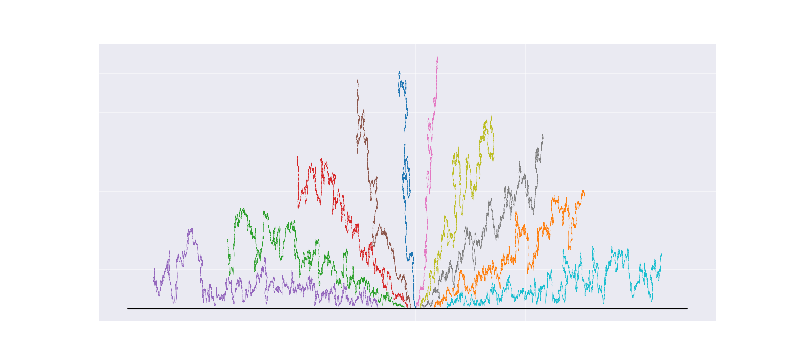
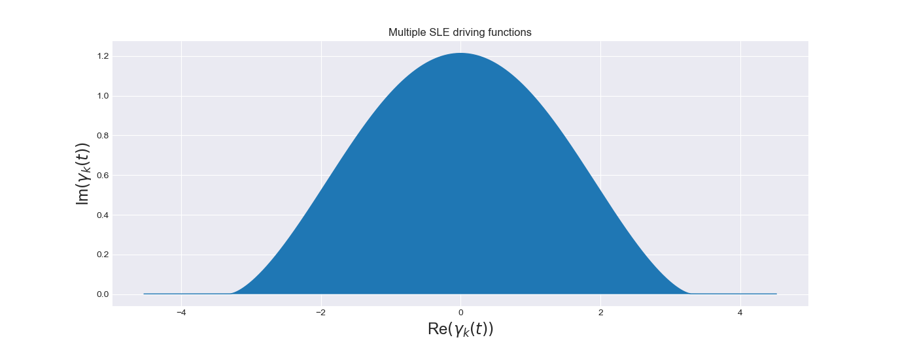

# Schramm-Loewner Evolution Library

**schramm_loewner_evolution** is a package that brings in Python the wonderful theory of Single and Multiple Schramm-Loewner Evolution!

 

## Examples
In this folder you may find several applications of the methods exposed by this package. 

 

### `multiple_chordal_sle.py`
This script will show how to import the **schramm_loewner_evolution** and how to use it to simulate 10 traces of the Multiple Chordal SLE.

 

### `burgers.py`
This script will show you the output of the method `multiple.burgers` of the **schramm_loewner_evolution** package.

